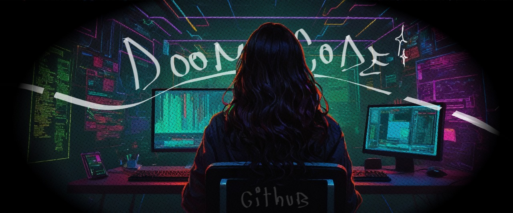
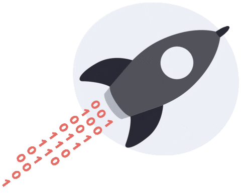

<h2 align="center">Ciao! The name's D00M 👽</h2> 

<h3 align="left">$~: Who am i? 👩🏻‍💻</h3>

  

    I'm a computer engineering student 🎓. One day i'd like to work as a pentester, since that is my true passion: break down things so i can understand them and make them     better. C'mon, isn't      that what's supposed to do an engineer 👺? No? Oh...
  

 
  

    Anyways, i am very passionate about Tech, and of course, i also love to come up with new ideas to make the world a better place.💡👩‍💻 
  

 
  

    On my spare time i enjoy learning new languages, drawing, reading, going out on hikes 🌲 or stuff like that, i'm a big fan of nature, coffee ☕ and misty forests too. 
  

 
  

    Currently i'm developing myself on the cybersecurity field 🥷🏻, completing courses and doing roadmaps to achive my goals. Besides from that, ì'm developing projects at my uni. And that's it for now! 
  

  

<h3>Languages que io parlo!</h3>
<ul type="None">
  <li>🔹 Spanish: Native</li>
  <li>🔹 English: C1 / Advanced</li>
  <li>🔹 Italian: A2 / Basic, currently learning!</li>
</ul>
 

<h3 align="left">My Tech Skills</h3>

I also have great social skills!, i count with experience in leadership and project managment, i'm still learning though

 

<h3>Some stats! </h3>

   
   
  
  

<h3 align="left">  Projects below! ⏬</h3>

