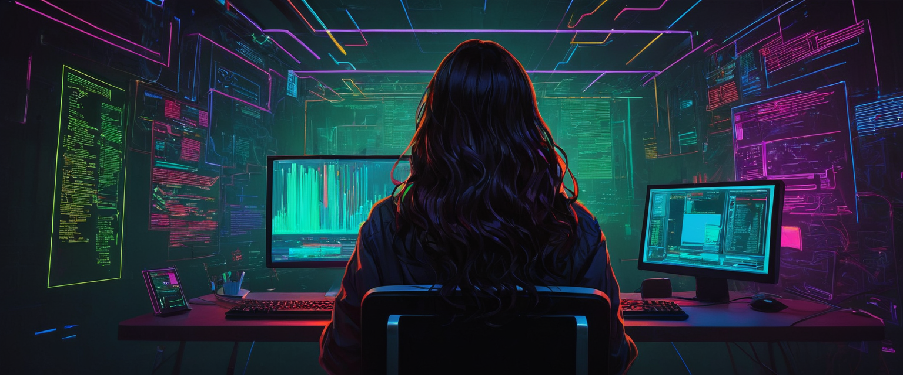

<h2 align="center">Ciao! The name's D00M 👽</h2> 

<h3>🟢 $~: Who am i? </h3>

I'm a student 🎓, currently on my 2nd year. Although I study computer science, one day i'd like to work as a <bold>pentester</bold>, since that is my true passion: <i>break down things to make them better.</i> C'mon, isn't that what's supposed to do an engineer 👺? No? Oh... 
Anyways, i am very passionate about Tech, and of course, i also love to come up with new ideas to make the world a better place.💡👩‍💻

<h5>🟩 Hobbys and freeeee time</h5>
On my spare time i enjoy learning new languages or drawing, you could say i am a very creative and sensitive person. I also love reading and going out on hikes or stuff like that, i'm a big fan of nature, coffee and misty forests too.

<h5>🟩 What i'm learning now?</h5>
Currently i'm developing myself on the cybersecurity field, completing courses and doing roadmaps to achive my goals. Besides from that, ì'm developing projects for my
university in wich i have to develope some AI tools, robotic software, and others. It hasn't been easy, but i can say i have a good performance. I'd love to do better someday at cloud computing, since that looks like something promising, but right now i don't have enough time for it.

<!--sintetiza esto y crea una vision -->

<h3>🟡 Languages</h3>

<h3>🔵 Tech Skills</h3>
🟦
🟦
🟦

<h3>🟣 Social Skills</h3>
🟪
🟪
🟪

<h3>Projects</h3>
voiddd

<h3>⚪️ some stats?</h3>

   
  

<h3>🟠 Reach me out </h3>
🟧
🟧
🟧

